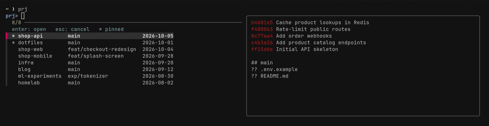

# prj

[](https://github.com/lAvArt/prj/actions/workflows/ci.yml)

**A project switcher for the terminal.** Fuzzy-pick one of your git repos and open it in Claude Code, Codex,
opencode or your editor: in a new herdr tab, a new tmux window, or right where you are.

Made on [Omarchy](https://omarchy.org); works on any Linux distribution and on macOS.



```sh
prj            # pick from the list
prj api        # open the project matching "api" directly
```

- **Set up in 30 seconds.** `prj --setup` finds the folders that hold your repos (home folders, mounted drives,
  dual-boot partitions) and asks three questions: what to run, where to open it, what to call the commands.
- **Your command names.** Type `dev`, `p`, `work`, or keep `prj`. You also get a cd command and tab completion.
- **Sorted the way you work.** Pinned projects first, then the ones you open most, then the latest commit.
- **Agent-ready.** Opens each project in its own herdr tab or tmux window, named after the project, with your agent
  already running. For Claude Code it adds a `/repo` skill so Claude can switch projects mid-session.
- **One bash script.** Needs only `git` and `fzf`. No daemon, no database, no tmux requirement.

## Install

<details open>
<summary><b>Omarchy and Arch Linux</b></summary>

```sh
curl -fsSL https://raw.githubusercontent.com/lAvArt/prj/main/install.sh | sh
```

Omarchy already has everything prj needs. On plain Arch: `sudo pacman -S --needed git fzf gum`.
</details>

<details open>
<summary><b>macOS</b></summary>

```sh
brew install lAvArt/tap/prj
prj --setup
```
</details>

<details>
<summary><b>Debian, Ubuntu, Pop!_OS, Mint</b></summary>

```sh
sudo apt install git fzf
curl -fsSL https://raw.githubusercontent.com/lAvArt/prj/main/install.sh | sh
```
</details>

<details>
<summary><b>Fedora, openSUSE, Alpine, others</b></summary>

```sh
sudo dnf install git fzf          # Fedora
sudo zypper install git fzf       # openSUSE
sudo apk add bash git fzf         # Alpine
curl -fsSL https://raw.githubusercontent.com/lAvArt/prj/main/install.sh | sh
```
</details>

<details>
<summary><b>From source</b></summary>

```sh
git clone https://github.com/lAvArt/prj && cd prj
make install          # into ~/.local; `sudo make install PREFIX=/usr` for system-wide
prj --setup
```
</details>

The install script puts `prj` in `~/.local/bin` and starts the setup wizard.
**Requirements:** bash 3.2 or newer, `git`, `fzf` 0.24 or newer.
**Optional:** `gum` (nicer wizard), `herdr`, `tmux`, `jq`.

## Setup

```
$ prj --setup
Looking for folders with git repos...
Which folders hold your projects?
> ✓ ~/code                            (14 repos)
  ✓ /run/media/me/Data/Development    (13 repos)
What should open in a project?        > claude   codex   opencode   hdl claude   nvim .   (nothing, just a shell)
Where should it open?                 > auto: new herdr/tmux tab if inside one, else here
Command you type to open a project    > dev
Command that just cd's into a project > dcd
Set up 'dev' and 'dcd' plus tab completion in your shell? Yes
Install a /repo skill so Claude Code can switch projects for you? Yes
```

Run it again any time to change your answers. For dotfiles and scripts, every answer has a flag:

```sh
prj --setup --yes --roots "~/code, ~/work" --run claude --open auto --name dev --cd-name dcd
```

## Usage

| Command | What it does |
|---|---|
| `prj` | Fuzzy picker with a git log and status preview |
| `prj api` | Open the matching project directly: exact name, else the one fuzzy match, else the picker |
| `prj api -- --continue` | Pass extra arguments to the run command |
| `prj api -o here` | Choose where it opens: `auto`, `herdr-tab`, `tmux-window`, `here` |
| `prj api -r "nvim ."` | Run something else this time |
| `prj -p api` | Print the path (your cd command uses this) |
| `prj -l` | List projects (`--tsv` for scripts) |
| `prj --doctor` | Check dependencies, folders and shell integration |
| `prj --edit` | Open the config file |
| `prj --uninstall` | Remove the shell hooks and skill that setup added (keeps your config) |

The names you chose during setup wrap these: with `dev`, `dev api` is `prj api`, and `dcd api` cd's into it.
`man prj` has the full reference.

## On Omarchy

- **Open projects from anywhere with a keybinding.** Add this line to `~/.config/hypr/bindings.lua`. `Super + Alt + P`
  then opens the picker in a new terminal, and your agent starts there:

  ```lua
  o.bind("SUPER + ALT + P", "Projects", { tui = "prj" })
  ```

- **Use Omarchy's dev layouts.** Set `run = hdl claude` (or `hdl cx`) in the config and each project opens in
  Omarchy's herdr layout, with editor, agent and terminal side by side. Omarchy aliases such as `cx` work too.
- **herdr and tmux.** From a herdr session (`Super + Ctrl + Return`) or tmux (`Super + Alt + Return`), projects
  open in a new tab or window named after the project.
- **Themes.** The picker uses your terminal's colors, so it changes with your Omarchy theme.

## Configuration

`~/.config/prj/config` (or `$XDG_CONFIG_HOME/prj/config`):

```ini
roots   = ~/code, /run/media/me/Data/Development   # folders that hold your projects
depth   = 1           # how deep to look for repos in each folder (1-5)
run     = claude      # typed in the project when it opens; empty opens a shell
open    = auto        # auto | herdr-tab | tmux-window | here
pinned  = shop-api, dotfiles                       # always listed first
exclude = *-stable, archive/*                      # name or path patterns to hide
name    = dev         # your open command
cd_name = dcd         # your cd command (empty for none)
```

| Environment variable | Purpose |
|---|---|
| `PRJ_CONFIG` | Use a different config file |
| `PRJ_STATE_DIR` | Where usage history is kept (default `~/.local/state/prj`) |
| `PRJ_SCAN_MOUNTS` | Where setup looks for drives (default `/run/media/$USER /media/$USER /mnt /Volumes`) |

## How it compares

| | prj | zoxide (`zi`) | tmux-sessionizer, sesh |
|---|---|---|---|
| Finds projects | Scans your project folders for git repos | Folders you've visited | Folders you list (sesh: plus zoxide's) |
| Opens | Your agent, editor or a shell | A cd | A tmux session |
| herdr tabs | Yes | No | No |
| Needs tmux | No | No | Yes |

They work well together: Omarchy's `cd` is zoxide, and every project you open with prj's cd command is recorded there too.

## Notes

- **Nested repos** (packages, submodules) are hidden, so you see only top-level projects.
- **Dual boot:** git worktrees created on Windows point to `D:/...` paths that Linux git can't follow. prj lists them
  as `(windows worktree)` and leaves them alone, since `git worktree repair` would break them for Windows.
- **Claude Code:** switching with `/repo` changes where Claude works, but not the project's `.claude/settings.json`,
  hooks or MCP servers, which load at startup. Opening the project with `prj` gives you all of them.
- **Older fzf:** the preview hides itself on narrow terminals with fzf 0.31 and newer; older versions keep it on.

## Development

```sh
make test     # 40+ checks in a throwaway HOME; `tests/run.sh /bin/bash` tests macOS's bash 3.2
make lint     # shellcheck
```

Packaging lives in [`packaging/`](packaging/). The Homebrew formula is in
[lAvArt/homebrew-tap](https://github.com/lAvArt/homebrew-tap).

## License

MIT
